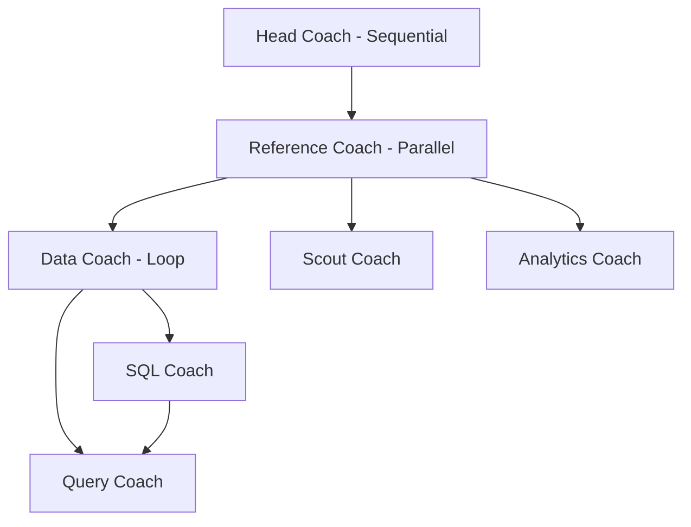
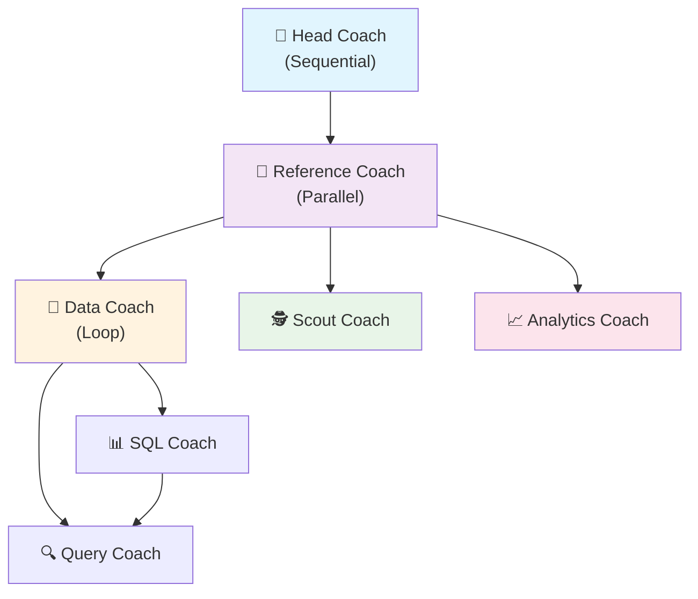

```
┌─────────────────────────────────────────────────────────────────────────────────────────────┐
│                                Head Coach (Sequential)                                      │
│                                                                                             │
│  ┌─────────────────────────────────────────────────────────┐                                │
│  │               Reference Coach (Parallel)                │                                │
│  │                                                         │                                │
│  │          ┌─────────────────────────────────┐            │                                │
│  │          │        Data Coach (Loop)        │            │                                │
│  │          │                                 │            │                                │
│  │          │  ┌─────────┐    ┌─────────────┐ │            │    ┌─────────────────────────┐ │
│  │          │  │   SQL   │───▶│    Query    │ │            │───▶│     Analytics Coach     │ │
│  │          │  │  Coach  │    │    Coach    │ │            │    └─────────────────────────┘ │
│  │          │  └─────────┘    └─────────────┘ │            │                                │
│  │          └─────────────────────────────────┘            │                                │
│  │          ┌─────────────────────────────────┐            │                                │
│  │          │           Scout Coach           │            │                                │
│  │          └─────────────────────────────────┘            │                                │
│  │                                                         │                                │
│  └─────────────────────────────────────────────────────────┘                                │
└─────────────────────────────────────────────────────────────────────────────────────────────┘
```

```
graph TD
    A[Head Coach - Sequential] --> B[Reference Coach - Parallel]
    B --> C[Data Coach - Loop]
    B --> D[Scout Coach]
    B --> E[Analytics Coach]
    C --> F[SQL Coach]
    C --> G[Query Coach]
    F --> G
```



